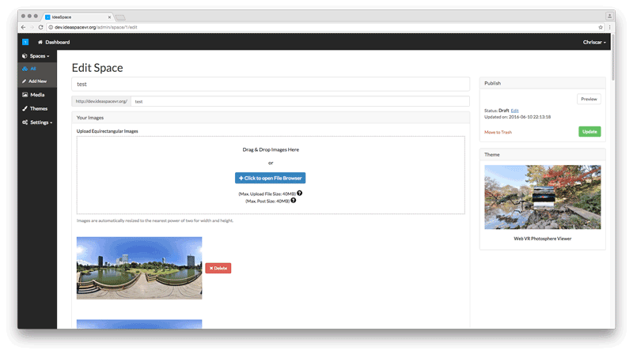

## IdeaSpace 

We believe that everyone should be able to easily create and publish virtual reality web experiences with the focus on content creation and creativity. 

Software developers should have the possibility to create and share virtual reality web themes.

## VR Themes

The latest release comes with 3 default themes: [Hello World](https://www.ideaspacevr.org/themes/hello-world-example-theme), [Web VR Photo Sphere Viewer](https://www.ideaspacevr.org/themes/web-vr-photo-sphere-viewer-navigation-menu), [Photo Sphere Diver](https://www.ideaspacevr.org/themes/web-vr-photo-sphere-diver-panorama).

## Download Latest Release

https://www.ideaspacevr.org/download

## Documentation

https://www.ideaspacevr.org/documentation

The IdeaSpace Theme API is currently in development. That's why the developer documentation is currently... well, under development. ;-)

## Contributing

https://www.ideaspacevr.org/documentation/master/contributions

## Roadmap

v1.0.0 release: Theme API will implement custom content types and fields. This will allow to develop 360 degree photo spheres with positioned annotations and links... and much more.

## License

The IdeaSpace CMS is open-sourced software licensed under the [GPL-2.0 license](https://opensource.org/licenses/GPL-2.0)

## Credits

IdeaSpace would not exist without these awesome projects:

- https://github.com/aframevr/aframe
- https://github.com/mrdoob/three.js
- https://github.com/laravel/laravel

