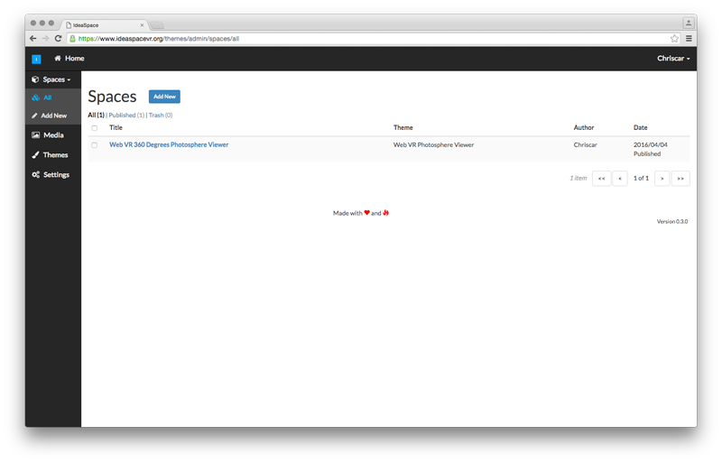

## IdeaSpace 

We believe that everyone should be able to easily create and publish virtual reality web experiences with the focus on content creation and creativity. 

Software developers should have the possibility to create and share virtual reality web themes.

## Download Latest Release

https://www.ideaspacevr.org/download

## Documentation

https://www.ideaspacevr.org/documentation

## Contributing

https://www.ideaspacevr.org/documentation/master/contributions

### License

The IdeaSpace CMS is open-sourced software licensed under the [GPL-2.0 license](https://opensource.org/licenses/GPL-2.0)

### Credits

IdeaSpace would not exist without these awesome projects:

- https://github.com/aframevr/aframe
- https://github.com/laravel/laravel

