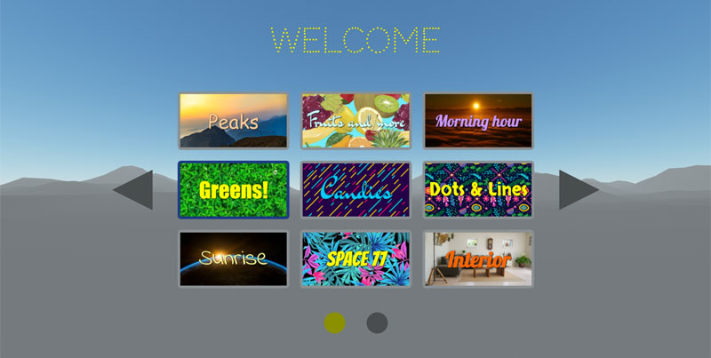

## About IdeaSpaceVR 

### Mission
<em>"We believe that everyone should be able to easily create and publish interactive 3D and VR web experiences with the focus on content creation and creativity. Software developers should have the possibility to bundle their creations as themes and share them."</em>

### Content Management System
Manage your virtual reality spaces and assets like you would manage blog posts. Run it on your own server. All you need is PHP and a database (MySQL or MariaDB). 

### Themes
Download and install themes and create a 3D/VR website. Or create your own theme with the Theme API [Take a look at our theme directory](https://www.ideaspacevr.org/themes). A theme can be anything - a 360 photo tour, a 3D artist portfolio, an interactive video or a blog in VR. 

### Based on WebVR API
IdeaSpaceVR is using WebVR for interactive 3D and VR experiences that is compatible with all modern web browsers on desktop, mobile and VR headsets. Therefore... we love [A-Frame](https://github.com/aframevr/aframe)! 

## Download Latest Release

https://www.ideaspacevr.org/download

## Documentation

https://www.ideaspacevr.org/documentation

## Contributing

https://www.ideaspacevr.org/documentation/1.1/contributions

## Screenshots

## Credits

IdeaSpace would not exist without these awesome projects:

- https://github.com/aframevr/aframe
- https://github.com/mrdoob/three.js
- https://github.com/laravel/laravel

## Security Vulnerabilities

If you discover a security vulnerability, please do not hesitate to file an issue: https://github.com/IdeaSpaceVR/IdeaSpace/issues

## License

The IdeaSpaceVR CMS is open-sourced software licensed under the <a href="https://opensource.org/licenses/MIT" target="_blank">MIT license</a>.

